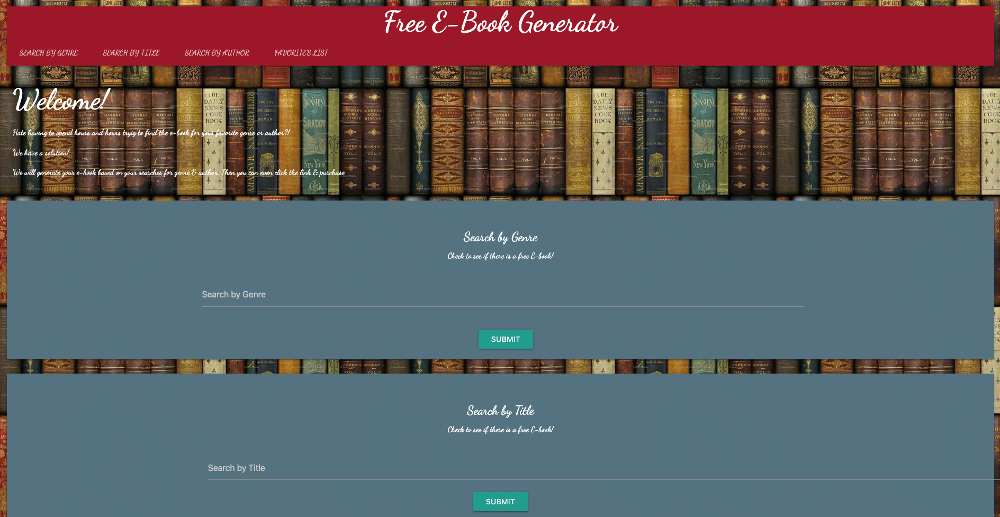

# top-book-generator

## Description
As a group, we wanted to create a resource for people to search and read free E-Books online by genre and author.

## Usage
To use our website, simply search a genre or familiar author name to access an assortment of books with a third party API. You are then able to favorite and store the book in a favorite's list and choose an option to read the book online.

## Live Link

https://terrencebudnik.github.io/top-book-generator/

## Credits
Project Gutenberg - https://www.gutenberg.org/
